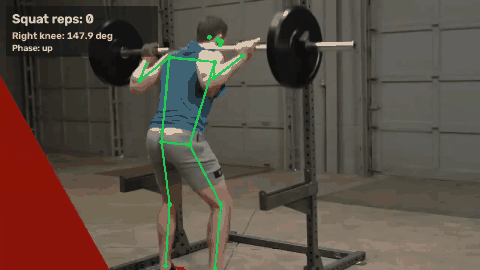

<div align="center">

# Real-Time Pose Estimation & Spatial Reasoning

**Companion code for our IEEE AISP 2024 paper on real-time human pose estimation with MediaPipe for health and fitness.**



<sub>Output of `python scripts/make_demo_gif.py`: this repo's landmarks, right-knee angle and rep counter on a CC BY 3.0 clip (see [assets/README.md](assets/README.md)).</sub>


[](https://doi.org/10.1109/AISP61711.2024.10870725)

</div>

## What this is

A small, runnable Python pipeline for webcam or video pose analysis:

- **33-landmark pose tracking** with the MediaPipe Tasks `PoseLandmarker` (lite / full / heavy models, downloaded on first run).
- **Joint angles** (elbows, shoulders, hips, knees) from 2D or 3D landmark vectors, plus per-joint velocity and acceleration.
- **Rep counting** on any joint angle with a smoothed down/up state machine (curls, squats, lunges).
- **Rule-based pose labels** (standing, squatting, push-up, curl, walking, running) from angle and motion thresholds.
- **Metric helpers** for OKS, AP/mAP, skeleton IoU and FPS, ready to use with your own annotated data.

## Relationship to the paper

This repository accompanies the paper below, on which I am the third of six authors. It is a reimplementation of the pipeline the paper describes, written after publication. It does not include the study's dataset or evaluation scripts.

| Field | Detail |
|-------|--------|
| **Title** | Real-Time Human Pose Estimation Using Media-Pipe an Artificial Intelligence Applications in Health and Fitness |
| **Authors** | K. Totlani, S. S. Dhavala, **S. Sandeep Kumar Vijayarao**, Y. Challagundla, B. Roy, E. R. Zhuo |
| **Venue** | 2024 4th International Conference on Artificial Intelligence and Signal Processing (AISP), IEEE, pp. 1–6 |
| **Date** | 26 October 2024 |
| **DOI** | [10.1109/AISP61711.2024.10870725](https://doi.org/10.1109/AISP61711.2024.10870725) |

**Results quoted from the paper (not reproduced by this repository):** 85% mAP, 0.78 IoU and 30+ FPS. Those numbers come from the study's own data and hardware. Reproducing them needs that dataset, which is not public here.

**What this repository measures itself:**

| Check | Result | How to re-run |
|-------|--------|---------------|
| Pose found on the bundled 213-frame sample clip | 213 / 213 frames | `python demo.py --input assets/sample_squat.webm --headless` |
| Squat reps counted on that clip | 2 (the clip contains 2) | `python scripts/make_demo_gif.py` |
| Processing time per 1280×720 frame, full model, CPU only | about 7–8 ms on an Apple M5 Pro (varies run to run) | same `demo.py` command; it prints average frame time |
| Real-model tests on a public-domain photo | passing in CI | `pytest` |

## Quick start

```bash
git clone https://github.com/sandeepvijayarao09/realtime-pose-estimation.git
cd realtime-pose-estimation
python3.12 -m venv .venv && source .venv/bin/activate
pip install -r requirements.txt

# Run on the bundled sample clip and count squat reps on the right knee
python demo.py --input assets/sample_squat.webm --rep-joint right_knee_angle --rep-min 100 --rep-max 160

# Or use your webcam (default counts curls on the left elbow)
python demo.py
```

The first run downloads the pose model (about 9 MB for `full`) into `./models`. Set `POSE_MODEL_DIR` to cache it elsewhere. MediaPipe 1.1 ships wheels for Apple Silicon macOS, Linux (x86_64 / aarch64) and Windows.

### Command-line options

```bash
python demo.py --input video.mp4            # video file instead of webcam
python demo.py --output out.mp4             # save the annotated video
python demo.py --headless --max-frames 300  # no window, stop after 300 frames
python demo.py --model-complexity 0         # 0 = lite, 1 = full (default), 2 = heavy
python demo.py --rep-joint left_knee_angle --rep-min 100 --rep-max 160   # squats
```

Controls: `Q` quits, `P` pauses.

## Architecture

```
Video / webcam ──► PoseLandmarker (MediaPipe Tasks, VIDEO mode)
                        │  33 landmarks, x/y/z + visibility
                        ▼
                  SpatialReasoning
                  joint angles · velocity · acceleration
                        │
          ┌─────────────┼──────────────┐
          ▼             ▼              ▼
     RepCounter    rule-based      optional LSTM
     (smoothed)    pose labels     (untrained, see below)
```

## Optional: LSTM activity classifier

`src/activity_classifier.py` contains a Keras LSTM for sequence-level activity recognition, with `train()`, `evaluate()`, `save_model()` and `load_model()`. **No trained weights are included**, so it does nothing useful until you train it on your own labelled pose sequences. Until it has weights, `predict_activity()` warns and falls back to a simple motion-magnitude heuristic.

```bash
pip install -r requirements-classifier.txt   # adds TensorFlow
python demo.py --classifier --classifier-weights my_model.keras
```

## Usage from Python

```python
import cv2
import numpy as np
from src.pose_estimator import PoseEstimator
from src.spatial_reasoning import SpatialReasoning

estimator = PoseEstimator(static_image_mode=True, model_complexity=1)
frame = cv2.imread("tests/fixtures/lunge.jpg")
found, landmarks = estimator.estimate_pose(frame)

points = {k: np.array([v.x, v.y, v.z, v.visibility]) for k, v in landmarks.items()}
angles = SpatialReasoning().compute_all_joint_angles(points, use_2d=True)
print(round(angles["right_knee_angle"].angle_degrees))  # about 87 for this lunge
estimator.close()
```

For video, construct with `static_image_mode=False` and pass a timestamp per frame: `estimator.estimate_pose(frame, timestamp_ms)`.

## Math

Joint angle from the two limb vectors meeting at a joint:

```
θ = arccos(v₁ · v₂ / (‖v₁‖ ‖v₂‖))
```

Object Keypoint Similarity (COCO):

```
OKS = Σᵢ exp(−dᵢ² / (2 s² σᵢ²)) δ(vᵢ > 0) / Σᵢ δ(vᵢ > 0)
```

## Project structure

```
realtime-pose-estimation/
├── src/
│   ├── pose_estimator.py        # MediaPipe PoseLandmarker wrapper + model download
│   ├── spatial_reasoning.py     # angles, velocities, rule-based labels, RepCounter
│   ├── activity_classifier.py   # optional LSTM (no weights shipped)
│   └── metrics.py               # OKS, AP/mAP, skeleton IoU, FPS
├── scripts/make_demo_gif.py     # regenerates assets/demo.gif
├── assets/                      # sample clip + demo GIF (licenses in assets/README.md)
├── tests/
│   ├── test_pose_estimator.py   # unit tests on synthetic landmarks
│   ├── test_real_estimator.py   # runs the real model on tests/fixtures/lunge.jpg
│   └── fixtures/                # public-domain test photo
├── demo.py
├── requirements.txt             # pinned runtime deps
├── requirements-dev.txt         # + pytest
└── requirements-classifier.txt  # + TensorFlow for the optional LSTM
```

## Testing

```bash
pip install -r requirements-dev.txt
pytest -v
```

`test_real_estimator.py` runs the actual pose model on a public-domain photo and checks that a person is found, that the landmarks are in anatomical order and that both knees read as bent in the lunge. The other tests cover the angle math, rep counter, metrics and FPS tracking with synthetic inputs.

## Citation

If you use this work, please cite the paper:

```bibtex
@inproceedings{totlani2024realtime,
  title     = {Real-Time Human Pose Estimation Using Media-Pipe an Artificial
               Intelligence Applications in Health and Fitness},
  author    = {Totlani, Ketan and Dhavala, Shiva S. and
               Vijayarao, S Sandeep Kumar and Challagundla, Yagnesh and
               Roy, B. and Zhuo, Eugenia R.},
  booktitle = {2024 4th International Conference on Artificial Intelligence
               and Signal Processing (AISP)},
  pages     = {1--6},
  year      = {2024},
  month     = {oct},
  publisher = {IEEE},
  doi       = {10.1109/AISP61711.2024.10870725},
  url       = {https://ieeexplore.ieee.org/document/10870725}
}
```

## License

Code: MIT, see [LICENSE](LICENSE). The sample clip and demo GIF are CC BY 3.0 (FitnessScape); the test photo is public domain. Details in [assets/README.md](assets/README.md) and [tests/fixtures/README.md](tests/fixtures/README.md).
